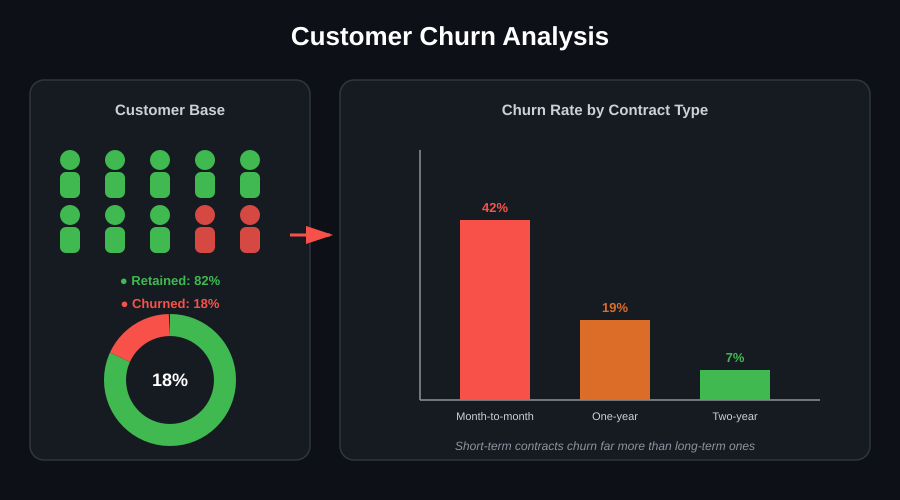

# 🛒 Customer Churn Prediction

## 📌 What is this project?
This project analyzes customer data to understand **why customers leave (churn)** and builds a model to **predict which customers are likely to churn next**. The goal is to help a business spot at-risk customers early and take action — like targeted offers or retention campaigns — before they leave.

## 🎯 Objective
- Explore customer data to find patterns behind churn
- Clean and prepare the data for analysis and modeling
- Build a machine learning model to predict churn
- Turn the findings into clear, actionable business recommendations

## 🛠️ Tools & Libraries
Python, Pandas, NumPy, Matplotlib, Seaborn, Plotly, Scikit-learn

## 🔍 Approach
1. **Data Cleaning** — handled missing values, fixed data types, removed duplicates
2. **Exploratory Data Analysis (EDA)** — visualized churn patterns across customer segments (contract type, tenure, charges, etc.)
3. **Feature Engineering** — prepared features for modeling
4. **Model Building** — trained and evaluated a classification model with Scikit-learn to predict churn
5. **Insights & Recommendations** — translated model results into business actions

## 📎 Project Resources
- 📊 [Dataset](PASTE_DATASET_LINK_HERE)
- 📓 [Jupyter Notebook (.ipynb)](PASTE_IPYNB_LINK_HERE)
- 📄 [Detailed Project Report](PASTE_REPORT_LINK_HERE)
